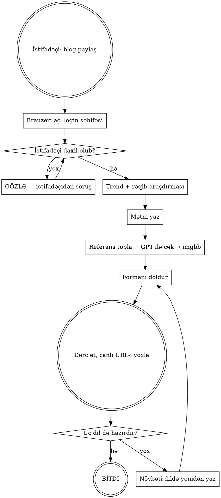

# Blog Publishing

## Əsas Prinsip

Blog postu **brauzerdə, admin panelindən, real istifadəçi kimi** dərc olunur — DB-yə birbaşa yazmaqla yox. Sən brauzeri açırsan, **istifadəçi Google ilə daxil olur**, sonra sən işə başlayırsan.

Hər postun üç sütunu var və heç biri buraxıla bilməz:

| Sütun         | Mənası                                                                  |
| ------------- | ----------------------------------------------------------------------- |
| **Araşdırma** | Mövzu Google-da bu həftə axtarılandır; rəqiblərin nə yazdığını bilirsən |
| **Səs**       | İnsan kimi düşünən, yumorlu, fəlsəfi, emosional, öz fikri olan mətn     |
| **Sübut**     | Hər fakt yoxlanılıb; hər şəkil real referans üzərində qurulub           |

## Hər Post ÜÇ Dildə Dərc Olunur

> **Bir mövzu = üç post: EN, TR, RU. İş yalnız üçü də canlı olanda bitir.**

Sayt üç dil daşıyır və hər post yalnız öz dilinin prefiksi altında xidmət olunur. Yalnız ingiliscə dərc etmək — türk və rus oxucusuna həmin səhifəni ümumiyyətlə göstərməmək deməkdir.

Üç post ayrı sətirlərdir: ayrı `slug`, ayrı `language`, ayrı URL. Onları bir-birinə **`Translation of`** sahəsi bağlayır və `hreflang` siqnalını yaradan da elə odur.

| Addım | Post      | `Translation of`                        |
| ----- | --------- | --------------------------------------- |
| 1     | EN (əsas) | `Not a translation` — yeni qrup yaranır |
| 2     | TR        | siyahıdan EN postu seç                  |
| 3     | RU        | siyahıdan **eyni** EN postu seç         |

**Tərcümə etmə — yenidən yaz.** Detallar: `references/voice.md` → Çoxdilli Postlar. Slug və xəta tələləri: `references/publishing.md` → Üç Dilin Axını.

Şəkillər üçüncü dəfə yüklənmir — hər üç post **eyni imgbb URL-lərini** işlədir. Yalnız `alt` mətni və altyazılar öz dilində yazılır.

## İş Axını



### 1. Brauzeri aç və girişi gözlə

```
mcp__plugin_playwright_playwright__browser_navigate
  → https://minna-six.vercel.app/en/admin/blogs
```

`/login`-ə yönləndirilirsənsə **istifadəçi hələ daxil olmayıb**. Bu addımda:

- **"Continue with Google" düyməsinə SƏN basma.** Brauzer pəncərəsi istifadəçinin qarşısındadır; parol onundur.
- İstifadəçiyə de: _"Brauzer açıqdır, Google ilə daxil ol və mənə de."_ Sonra **dayan və cavabını gözlə**.
- İstifadəçi təsdiq edəndən sonra `browser_navigate` ilə `/en/admin/blogs`-a qayıt və `browser_snapshot` ilə postlar cədvəlini gördüyünü təsdiqlə.

Sessiya Playwright profilində qalır — istifadəçi adətən bir dəfə daxil olur.

### 2. Araşdır (mətn yazmazdan ƏVVƏL)

Nə yazacağını qərar verməzdən əvvəl **nəyin axtarıldığını** öyrən. Tam metodika: `references/research.md`.

Minimum: AniList trend sorğusu + `WebSearch` ilə son 7 günün xəbərləri + ilk 3 rəqib məqaləsini `WebFetch` ilə oxu (onların başlıq strukturunu, uzunluğunu, əskik qoyduqlarını çıxar).

### 3. Yaz

Səs, struktur və "Top 10" formatı: `references/voice.md`.

Body **Markdown**-dır; `figure`, `aside`, `details`, `time`, `abbr`, `mark` kimi semantik HTML də icazəlidir (`src/lib/blog/markdown.ts` sanitizer).

Başlıq səviyyələri: bədəndə `h1` YAZMA — səhifənin özü `h1`-dir. `##`-dan başla. Hər başlıq JSON-LD-də `hasPart` bölməsinə çevrilir, ona görə başlıqlar suala cavab verən olmalıdır ("Niyə bu il isekai bezdirdi?"), "Bölmə 3" yox.

### 4. Şəkilləri hazırla

**Postun bölmə şəkilləri ChatGPT ilə yaradılır — amma heç biri yaddaşdan çəkilmir: hər generasiyaya real referans şəkli əlavə olunur.**

**Tam prosedur və qadağalar: `references/images.md`.** Qısası:

1. **Referans topla:** rəsmi artwork/portret üçün AniList CDN, səhnə/kadr üçün Google Şəkillər (`udm=2`). `.playwright-mcp/refs/` altına endir və `Read` ilə BAX — doğru personajdırmı?
2. **Referansı ChatGPT söhbətinə əlavə et** (`browser_file_upload`), sonra promptu yaz: `references/chatgpt-images.md`. Bir söhbətdə bir personaj, maksimum 3 şəkil.
3. Cover-i `assets/cover-template.html` ilə qur, Playwright ilə screenshot al (kompozisiya, generasiya yox).
4. **Nəticəni `Read` ilə AÇ VƏ REFERANSLA TUTUŞDUR** — saç, göz, paltar uyğundurmu; mətn/deformasiya varmı.
5. `scripts/imgbb-upload.mjs` ilə imgbb-yə yüklə, dönən `i.ibb.co` URL-ini istifadə et. Referans faylı yüklənmir.

imgbb API açarı skriptin içindədir — heç kimdən istəmə.

**Hansı şəkil haradan:**

| Şəkil nə göstərir                       | Mənbə                                         |
| --------------------------------------- | --------------------------------------------- |
| Bölmə şəkli — personaj, səhnə, əhval    | **ChatGPT + referans şəkli** (maks. 3/söhbət) |
| Atmosfer, metafora, ayırıcı (insansız)  | ChatGPT, referanssız da olar                  |
| Cover, Top 10 kartı, müqayisə           | HTML kompozisiya + screenshot                 |
| Referans mənbəyi (posta getmir)         | AniList CDN → Google Şəkillər (`udm=2`)       |
| Konkret epizod/tarix iddiası olan şəkil | Rəsmi mənbə — generasiya YOX                  |

### 5. Formanı doldur

`/en/admin/blogs/new`. Sahələri `browser_fill_form` ilə doldur (ref-lər `browser_snapshot`-dan gəlir). Tam sahə xəritəsi: `references/publishing.md`.

| Sahə                | id                    | Qayda                                                          |
| ------------------- | --------------------- | -------------------------------------------------------------- |
| Title               | `title`               | ≤60 simvol ki, SERP-də kəsilməsin; açar söz önə                |
| Slug                | `slug`                | Boş qoy → başlıqdan yaranır. Latın olmayan başlıqda ƏLLƏ yaz   |
| Excerpt             | `excerpt`             | 140–160 simvol; meta description budur                         |
| Content             | `content`             | Markdown bədən                                                 |
| Tags                | `tags`                | Vergüllə, maksimum 12 — hər biri indekslənən arxiv səhifəsidir |
| Cover image URL     | `coverImage`          | imgbb `i.ibb.co` URL-i                                         |
| Cover alt text      | `coverImageAlt`       | Şəkli təsvir et, açar söz yığma                                |
| Author / Author URL | `author`, `authorUrl` | E-E-A-T müəllif entity-si                                      |
| Language            | `language`            | `en` / `tr` / `ru` — postun yazıldığı dil                      |
| Published           | `published`           | Yoxlanana qədər söndür, sonra yandır                           |

### 6. Dərc et və YOXLA

`Create post` → siyahıya qayıdır. Sonra **canlı URL-i aç** (`/en/blogs/<slug>`) və `browser_snapshot` ilə təsdiqlə:

- Cover şəkli görünür (sınıq deyil — `next/image` `i.ibb.co`-nu qəbul edir, `next.config.ts`-də icazəlidir).
- Bədəndəki bütün şəkillər yüklənir.
- Başlıq iyerarxiyası düzgündür, mündəricat doludur.

Yoxlamadan "dərc olundu" demə.

## Mütləq Qadağalar

| Qadağa                                                | Səbəb                                                            |
| ----------------------------------------------------- | ---------------------------------------------------------------- |
| Referans əlavə etmədən personaj generasiya etmək      | Model təxmin edir — oxucunun tanımadığı yad personaj çıxır.      |
| Generasiyanı "rəsmi kadr/screenshot" kimi təqdim et   | Oxucunu aldadır. Epizod iddiası varsa rəsmi mənbə lazımdır.      |
| Fan-art və ya watermark-lı şəkli referans vermək      | Model imzanı və üslub təhrifini də kopyalayır.                   |
| AI ilə şəkil üzərində mətn yazdırmaq                  | Generativ modellər hərfləri korlayır. Mətn HTML/CSS ilə yazılır. |
| Şəklə baxmadan (və referansla tutuşdurmadan) yükləmək | Uyğunsuzluq və məntiq xətaları yalnız yan-yana baxanda görünür.  |
| Bir ChatGPT söhbətində 3-dən çox şəkil / 2 personaj   | Üslub donur, referanslar qarışır. Yeni söhbət aç.                |
| Yalnız bir dildə dərc edib dayanmaq                   | EN + TR + RU məcburidir. İkisi qalıbsa iş bitməyib.              |
| TR/RU-nu `Translation of` seçmədən yaratmaq           | `hreflang` bağlanmır — üç yetim post qalır.                      |
| Yoxlanmamış fakt (tarix, epizod sayı, studiya)        | AniList/rəsmi mənbədən təsdiqlə, yoxsa yazma.                    |
| Emoji                                                 | Layihə qaydası — yalnız SVG ikonlar.                             |
| İstifadəçinin adından Google/ChatGPT-yə daxil olmaq   | Parol onundur. Gözlə.                                            |
| Yoxlamadan "hazırdır" demək                           | Canlı URL-i aç, gözünlə gör.                                     |

## Tez-tez Rast Gəlinən Səhvlər

**"Slug avtomatik yaranacaq"** — Kiril və ya tam türk başlığında `slugify` boş qaytarır və forma `invalidSlug` xətası verir. Latın olmayan başlıqda slug-u əllə yaz.

**"Bir mövzuda üç dildə post"** — Hər dil ayrı postdur. İkincisini yazanda `Translation of` sahəsində birincini seç, yoxsa `hreflang` bağlanmır. Eyni qrupda eyni dildən iki post olmaz (`translationExists`).

**"Şəkil admin panelində görünür, deməli işləyir"** — Cover `next/image`-dən keçir, bədən şəkilləri yox. Fərqli yollardır; canlı səhifədə hər ikisini yoxla.

**"Codex CLI şəkil çəkəcək"** — Çəkmir. Codex-in şəkil generasiya aləti yoxdur (`references/images.md`). Generasiya brauzerdən ChatGPT ilə aparılır.

**"Top 10-un şəkillərini ChatGPT bir söhbətdə çəksin"** — Yox. Referanssız — heç bir animeyə aid olmayan on şəkil alırsan; hamısı bir söhbətdə — hamısı bir-birinə oxşayır. Hər bənd üçün **öz rəsmi referansı** tapılır, öz söhbətində çəkilir. Siyahı kartı və cover isə generasiya deyil, HTML kompozisiyadır.

**"Referansı posta qoyum, hazır şəkildir"** — Yox. Referans generasiyanın girişidir; posta generasiya olunmuş şəkil gedir. İstisna: konkret epizod/kadr iddiası edən şəkil — o, rəsmi mənbədən getməlidir.

## Fayllar

| Fayl                           | Nə üçün                                              |
| ------------------------------ | ---------------------------------------------------- |
| `references/research.md`       | Trend axtarışı, rəqib analizi, açar söz seçimi       |
| `references/voice.md`          | Redaksiya səsi, Top 10 strukturu, başlıq düsturları  |
| `references/images.md`         | Şəkil boru xətti, imgbb açarı, qadağalar, DPR tələsi |
| `references/chatgpt-images.md` | Referans tapmaq, ChatGPT-yə əlavə etmək, generasiya  |
| `references/publishing.md`     | Brauzer addımları, sahə xəritəsi, xəta mesajları     |
| `assets/cover-template.html`   | 16:9 cover kompozisiya şablonu                       |
| `scripts/imgbb-upload.mjs`     | `node ... <fayl-və-ya-URL> <ad>` → `i.ibb.co` URL-i  |
| `scripts/save-base64.mjs`      | `node ... <fayl> < payload.b64` → binar fayl         |
