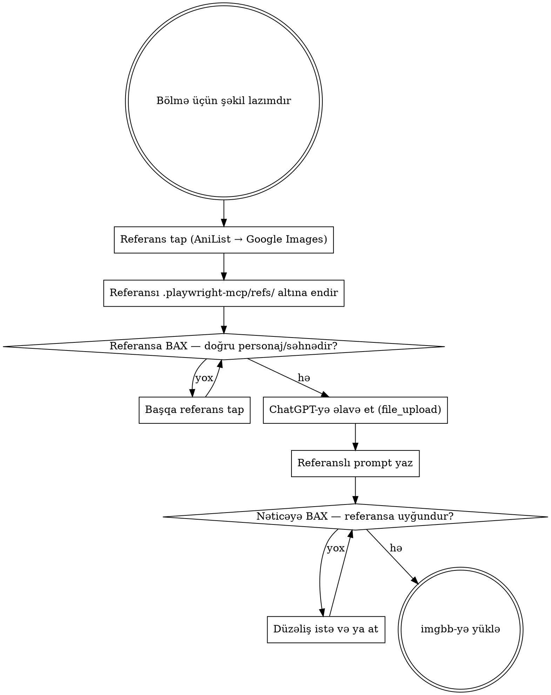

# ChatGPT ilə Şəkil Generasiyası (referans əsaslı)

Şəkil generasiyası **chatgpt.com saytında, istifadəçinin öz hesabında** aparılır. Codex CLI-də şəkil aləti yoxdur; higgsfield kredit tələb edir. Bu yol istifadəçinin artıq ödədiyi hesabdan istifadə edir.

## Dəyişməz Qayda: Referanssız Generasiya Yoxdur

> **Modeldən heç vaxt "yaddaşdan" çəkməsini istəmə. Hər generasiyadan əvvəl real referans şəkli tapılır, söhbətə əlavə olunur, sonra prompt yazılır.**

Səbəbi sadədir: model "Frieren" adını eşidəndə saçı, gözü, paltarı, yaşı təxmin edir — nəticə oxucunun tanımadığı yad bir personaj olur. Rəsmi artwork şəkil kimi əlavə ediləndə model artıq təxmin etmir, **referansı yenidən səhnələşdirir**. Fərq faktiki dəqiqlikdir.

**Postun bölmə (bədən) şəkilləri bu yolla — referans əsaslı ChatGPT generasiyası ilə — hazırlanır.** Rəsmi artwork birbaşa posta qoyulmur; o, generasiyanın **girişidir**.



## 1. Giriş Əl Sıxma

```
browser_navigate → https://chatgpt.com/
browser_snapshot
```

Snapshot-da `button "Log in"` və _"Log in to get answers based on saved chats, plus create images and upload files"_ görürsənsə — **istifadəçi daxil deyil; nə şəkil generasiya olunur, nə də fayl əlavə edilir**.

Bu halda:

- **`Log in` düyməsinə SƏN basma, parol yazma.** Hesab istifadəçinindir.
- De ki: _"chatgpt.com açıqdır, hesabına daxil ol və mənə de."_
- **Dayan və gözlə.** İstifadəçi təsdiq edənə qədər brauzerdə heç bir addım atma.

Daxil olandan sonra snapshot-da composer görünür. Sessiya Playwright profilində qalır.

## 2. Referansı Tap

Referans **real olmalıdır**: rəsmi artwork, rəsmi kadr və ya rəsmi press şəkli. Fan-art, başqa AI şəkli, imzalı/watermark-lı şəkil referans kimi işə yaramır — model imzanı da kopyalayır.

### 2.1 AniList — birinci yer (personaj və cover)

Rəsmi personaj portretləri və cover/banner birbaşa AniList CDN-dədir:

```bash
curl -s -X POST https://graphql.anilist.co -H "Content-Type: application/json" \
  --data-binary @- <<'Q'
{"query":"{Media(search:\"Frieren\",type:ANIME){title{romaji} coverImage{extraLarge} bannerImage characters(perPage:6,sort:FAVOURITES_DESC){nodes{name{full} image{large}}}}}"}
Q
```

`characters.nodes[].image.large` → personajın rəsmi portreti. `bannerImage` (1900×400) → mövsüm/atmosfer referansı. Sıfır uydurma riski, birbaşa endirilə bilir:

```bash
mkdir -p .playwright-mcp/refs
curl -sL "https://s4.anilist.co/file/anilistcdn/character/large/bXXXX.png" \
  -o .playwright-mcp/refs/frieren-portrait.png
```

### 2.2 Google Şəkillər — ikinci yer (səhnə, kadr, kompozisiya)

AniList-də konkret **səhnə** yoxdur — yalnız portret və cover. Səhnə, poza, mühit üçün Google Şəkillər:

```
browser_navigate → https://www.google.com/search?udm=2&q=frieren+anime+official+key+visual+sunset+field
browser_snapshot
```

`udm=2` birbaşa Şəkillər tabını açır. Nəticəni klikləyəndə sağ paneldə böyük versiya açılır; tam ölçülü `src`-i belə çıxar:

```
browser_evaluate → () => [...document.querySelectorAll('img')]
    .map(i => ({ src: i.src, w: i.naturalWidth, h: i.naturalHeight }))
    .filter(i => i.w > 500 && !i.src.startsWith('data:'))
    .slice(0, 5)
```

Endirmə: əvvəl `curl -sL "<src>" -o .playwright-mcp/refs/<ad>.jpg`. CDN referer yoxlayırsa (boş fayl və ya 403) — səhifə kontekstindən oxu (Bölmə 6, Yol B mexanizmi) və `save-base64.mjs` ilə yaz.

**Axtarış sözləri:** `<anime adı> official art`, `<anime> key visual`, `<personaj> official render`, `<anime> episode <N> screenshot`. `wallpaper`, `fanart`, `edit`, `4k pc` sözləri fan işi gətirir — istifadə etmə.

### 2.3 Referans Seçim Meyarları

| Yaxşı referans                        | Rədd et                               |
| ------------------------------------- | ------------------------------------- |
| Rəsmi artwork / key visual / kadr     | Fan-art, cosplay, başqa AI şəkli      |
| Ən azı 500px enində, aydın            | Kiçik, bulanıq, sıxılmış thumbnail    |
| Tək personaj tam görünür              | Kollaj, on personajlı qrup şəkli      |
| Təmiz — mətn/logo/imza yoxdur         | Watermark, altyazı, kanal logosu      |
| Postda danışılan anime/personajdandır | "Bənzər görünən" başqa serialın şəkli |

### 2.4 Referansa BAX

```
Read .playwright-mcp/refs/frieren-portrait.png
```

Buraxıla bilməz. Səhv referans = səhv personaj = faktiki yalan. Yoxla: bu həqiqətən yazdığın personajdır? Watermark var? Kadr sıxılıb korlanıb?

**Referans şəkli posta qoyulmur və imgbb-yə yüklənmir.** O, yalnız modelə verilir.

## 3. Referansı Söhbətə Əlavə Et

```
browser_snapshot      → composer-in yanındakı əlavə etmə düyməsini tap
browser_click         → "Add photos and files" / plus düyməsi
browser_file_upload   → paths: ["C:\\Users\\cahan\\projects\\minna\\.playwright-mcp\\refs\\frieren-portrait.png"]
browser_snapshot      → composer-də kiçik önizləmə göründü?
```

Qeydlər:

- Yol **mütləq absolute** olmalıdır; `browser_file_upload` nisbi yol qəbul etmir.
- `browser_click`-dən sonra menyu açılırsa, `Add photos & files` bəndini də klikləmək lazım gəlir — fayl seçici yalnız ondan sonra açılır.
- `browser_file_upload` "no file chooser" xətası verirsə: seçici açılmayıb. Snapshot götür, düyməni yenidən kliklə.
- **Göndərməzdən əvvəl snapshot ilə əlavənin göründüyünü təsdiqlə.** Referanssız göndərilən prompt = yaddaşdan çəkilmiş yad personaj; o şəkil atılmalıdır.
- Bir generasiya üçün **maksimum 3 referans** (məs. personaj portreti + mühit kadrı). Çoxu modeli qarışdırır.

## 4. Prompt Şablonu

```
The attached image is the official reference for <PERSONAJ> from <ANIME>.
Keep the character faithful to the reference: hair colour and shape, eye colour,
costume details, silhouette, age. Do not redesign, do not age up or down.

New scene: <bölmənin mövzusu — məs. "standing alone on a rain-soaked night street,
looking back over the shoulder, city lights out of focus behind">.

Style: cinematic anime illustration, dark, high contrast, deep shadows, one red
accent light (#E50914), 16:9 wide composition. No text, no letters, no logos,
no watermarks, no signature, no border, no extra characters.
```

Qaydalar:

- **Personajın adını VƏ animenin adını yaz.** Referans forma verir, ad kontekst verir.
- **Bir şəkildə bir personaj.** İki personaj = qarışmış sifətlər.
- Səhnə postun həmin bölməsindən gəlir — təsadüfi poza yox. Bölmə "isekai yorğunluğu"ndan danışırsa, şəkil də yorğunluğu göstərsin.
- **16:9 wide** de — cover və sosial kart bu nisbətdə kəsilir.
- Şəkil üzərinə mətn heç vaxt istəmə. Model hərfləri korlayır; mətn HTML/CSS ilə yazılır.

Atmosfer/metafora şəkli (personajsız — boş kinoteatr, dayanmış saat, neon dalan) üçün referans şərt deyil; həmin halda promptun sonuna `no characters, no people, no faces` bəndini əlavə et.

## 5. Bir Söhbətdə Maksimum 3 Şəkil

> **Bir söhbətdə 3 şəkildən çox generasiya etmə. 3-cüdən sonra YENİ söhbət aç.**
>
> **Bir söhbətdə bir personaj.** İkinci personajın referansını eyni söhbətə atma — model birincinin saçını, paltarını, işığını ona daşıyır.

Sayğacı özün saxla:

```
Söhbət 1 (Frieren): [1/3] açılış səhnəsi · [2/3] bölmə ayırıcısı → 1 qaldı
Söhbət 2 (Gojo):    [1/3] ...
```

Yeni söhbət (yoxlanılıb — sidebar-dakı "New chat" linkinin `href`-i `/`-dir):

```
browser_navigate → https://chatgpt.com/
```

Klikləməyə ehtiyac yoxdur. Səhifə boş composer ilə açılır.

## 6. Composer və Nəticənin Çıxarılması

Composer **yalnız daxil olandan sonra DOM-da olur**. Selektoru sabit yazma; hər dəfə `browser_snapshot` götür və ref-i oradan al. Adətən prompt sahəsi `#prompt-textarea` (contenteditable), göndər düyməsi `[data-testid="send-button"]`.

Yazmaq üçün `browser_type` (ref ilə), sonra `browser_press_key` → `Enter`. Generasiya 15–60 saniyə çəkir; `browser_wait_for` ilə gözlə, sonra snapshot götür.

Şəklin `src`-ini götür:

```
browser_evaluate → () => [...document.querySelectorAll('main img')]
    .map(i => ({ src: i.src, w: i.naturalWidth, h: i.naturalHeight }))
    .filter(i => i.w > 400)
```

**Diqqət:** əlavə etdiyin referans da `main img` içindədir. Həmişə **sonuncu** böyük şəkli götür (`.pop()`) — birincini götürsən öz referansını yükləmiş olarsan.

### Yol A — URL-i birbaşa imgbb-yə ver (ən təmiz)

ChatGPT şəkilləri imzalanmış blob URL-ləri ilə verilir; imgbb serveri onları özü çəkə bilir:

```bash
node .claude/skills/blog-publishing/scripts/imgbb-upload.mjs \
  "<şəklin src URL-i>" "frieren-rain-street-night"
```

Alınmırsa (imza vaxtı bitib və ya 403) — Yol B.

### Yol B — Səhifə kontekstindən oxu

```
browser_evaluate → async () => {
  const img = [...document.querySelectorAll('main img')]
    .filter(i => i.naturalWidth > 400).pop();
  const r = await fetch(img.src);
  const u = new Uint8Array(await r.arrayBuffer());
  let s = '';
  for (let i = 0; i < u.length; i++) s += String.fromCharCode(u[i]);
  return btoa(s);
}
```

```bash
node .claude/skills/blog-publishing/scripts/save-base64.mjs \
  .playwright-mcp/generated.png < payload.b64
```

Fayl **layihə kökünün içində** olmalıdır (Playwright/`.playwright-mcp` qaydası).

## 7. BAX və Referansla Tutuşdur

```
Read .playwright-mcp/refs/frieren-portrait.png
Read .playwright-mcp/generated.png
```

Bu addım buraxıla bilməz. İkisini yan-yana yoxla:

- **Saç rəngi/forması, göz rəngi, paltar detalları, yaş** referansla uyğundurmu? Uyğun deyilsə oxucu personajı tanımayacaq — **at**.
- Şəkildə **mətn/hərf/imza yoxdur** (model gizli şəkildə yazı əlavə edir).
- Əl, barmaq, göz sayı normaldır. Deformasiya varsa **at**, düzəltməyə çalışma.
- Perspektiv və işıq məntiqlidir (kölgə işıq mənbəyi ilə uyğundur).
- Fon həqiqətən qaradır, boz-qəhvəyi deyil.
- Şəkil postun **həmin bölməsinin** mövzusunu göstərir.

Uyğun deyilsə: eyni söhbətdə düzəliş istə (sayğacda yeni şəkil sayılır) — məs. _"Keep the pose but match the hair colour to the reference exactly"_ — və ya sayğac dolubsa yeni söhbətdə yenidən başla.

## 8. Posta Qoyarkən Dürüstlük

Generasiya olunmuş şəkil **rəsmi kadr deyil** və elə təqdim edilə bilməz.

| Yaz                                                                 | Yazma                               |
| ------------------------------------------------------------------- | ----------------------------------- |
| `alt`: səhnəni təsvir et — "Yağışlı gecə küçəsində dayanan Frieren" | "Frieren 12-ci bölümdən kadr"       |
| `figcaption`: bölməyə bağlayan cümlə, illüstrasiya olduğu bilinsin  | "Rəsmi screenshot", "Studiya kadrı" |

Konkret epizod, tarix və ya kadr iddiası edirsənsə — o zaman şəkil **rəsmi mənbədən** gəlməlidir, generasiyadan yox.

## Qadağan

| Qadağa                                           | Səbəb                                                      |
| ------------------------------------------------ | ---------------------------------------------------------- |
| Referans əlavə etmədən personaj generasiya etmək | Model təxmin edir — oxucunun tanımadığı yad personaj çıxır |
| Mövcud olmayan anime/personaj uydurmaq           | Faktiki yalan; postun "Sübut" sütunu dağılır               |
| Fan-art və ya watermark-lı şəkli referans vermək | Model imzanı və üslub təhrifini də kopyalayır              |
| Bir söhbətdə iki fərqli personajın referansı     | Model onları qarışdırır — hibrid sifət                     |
| Şəkil üzərində mətn, logo, başlıq                | Model hərfləri korlayır. Mətn HTML/CSS ilə yazılır.        |
| Nəticəni referansla tutuşdurmadan yükləmək       | Uyğunsuzluq yalnız yan-yana baxanda görünür                |
| Generasiyanı "rəsmi kadr" kimi təqdim etmək      | Oxucunu aldadır, şəkil axtarışında uyğunsuz siqnal yaradır |
| İstifadəçinin adından ChatGPT-yə daxil olmaq     | Hesab onundur. Gözlə.                                      |

## Hansı Şəkil Haradan — Qərar Cədvəli

| Şəkil nə göstərməlidir                  | Mənbə                                               |
| --------------------------------------- | --------------------------------------------------- |
| Bölmə şəkli — personaj, səhnə, əhval    | **Referans + ChatGPT** (bu sənəd)                   |
| Atmosfer/metafora (insansız)            | ChatGPT, referanssız da olar                        |
| Cover, Top 10 kartı, müqayisə cədvəli   | **HTML kompozisiya** (`assets/cover-template.html`) |
| Referans mənbəyi (posta getmir)         | AniList CDN → Google Şəkillər (`udm=2`)             |
| Konkret epizod/tarix iddiası olan şəkil | Rəsmi mənbə — generasiya YOX                        |

## Sürətli Yoxlama Siyahısı

- [ ] İstifadəçi chatgpt.com-a daxil olub (sən yox)
- [ ] Referans tapılıb, endirilib, `Read` ilə baxılıb — rəsmi, təmiz, doğru personaj
- [ ] Referans söhbətə əlavə olunub və snapshot-da görünür
- [ ] Prompt-da personajın + animenin adı və "faithful to the reference" bəndi var
- [ ] Prompt-da "no text, no letters, no logos, no watermarks" var
- [ ] Bu söhbətdə hələ 3 şəkil olmayıb, söhbətdə tək bir personaj var
- [ ] Nəticə `Read` ilə açılıb və referansla tutuşdurulub
- [ ] Şəkildə mətn, deformasiya, əlavə personaj yoxdur
- [ ] `alt`/altyazı şəkli "rəsmi kadr" kimi təqdim etmir
- [ ] imgbb-yə açar söz adı ilə yüklənib (generasiya, referans yox)
- [ ] 3-cü şəkildən sonra `browser_navigate → https://chatgpt.com/` ilə yeni söhbət açılıb
